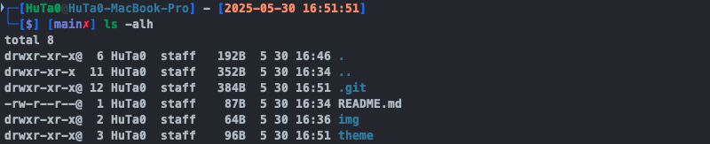
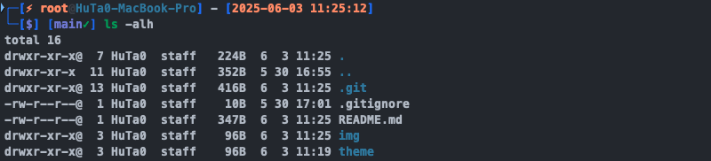

# zsh-theme
My own oh-my-zsh theme, and a modified version to suit my own preferences.

The width of the sample image is 800px.

## Install

Place the theme file in the `~/.oh-my-zsh/themes` directory.

Replace the value of `ZSH_THEME` in `~/.zshrc` with `la-vaguelette`.

## Example

### La Vaguelette

